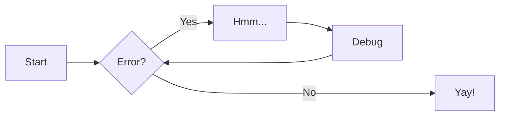
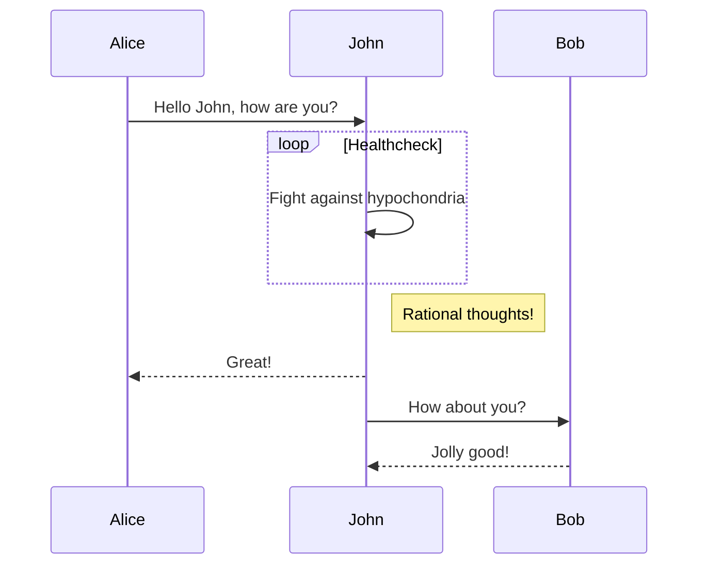
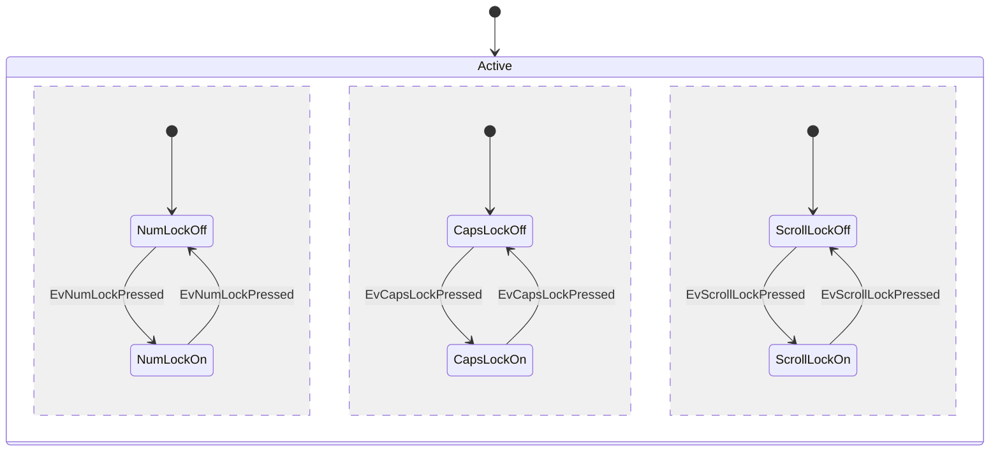
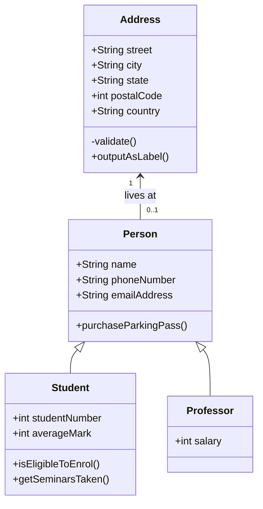
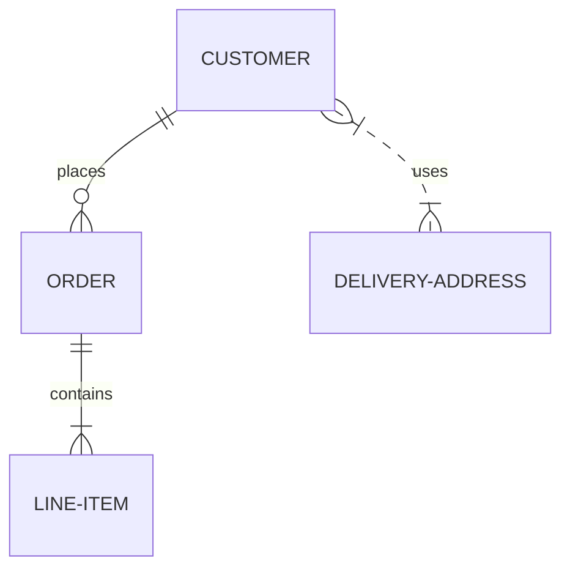

# OWSAP shepherd
**说明**:本文档主要针对当前最新版owaspSecurityShepherd_v3.1_VM进行编写,如果您使用的是其他版本，可能存在略微差异

## 介绍
OWASP security shepherd项目是web和移动应用安全培训平台.该项目的目的培养和提高不同技能人群的安全意识。让AppSec新手或经验丰富的研发/测试工程师提高他们的安全测试技能，成为安全专家。  

[OWSAP shepherd github代码](https://github.com/OWASP/SecurityShepherd)

## 优点
作者自身列举了很多:  
[owasp shepherd 优点](https://github.com/OWASP/SecurityShepherd#why-choose-security-shepherd)

整理几条认为比较主要的:  

- 持续更新   
这个项目作者还在持续更新，不断加入最新产生的安全漏洞，非常难得   
从github issus看,参与的用户非常多，受到了广大用户的喜爱

- 覆盖web和移动漏洞  
同时有web和移动漏洞的靶场比较少见

- 漏洞分等级   
可以适合不同需求的同学学习，如研发和测试同学(仅使用前两个等级)

- 源代码开源且安全  
源代码开源，可根据自身需求进行修改  
源代码中增加了很多安全防护，作为源代码审计、安全开发的典范项目 

## 安装


**vmware虚拟机安装**  

- 下载当前最新版3.1 vm  
[owaspSecurityShepherd_v3.1_VM.zip](https://github4.com/OWASP/SecurityShepherd/releases/download/v3.1/owaspSecurityShepherd_v3.1_VM.zip)
- 使用vmware打开
- 主机登录账号  
用户名:securityshepherd   
密码: shepherd3.1  
该账号可以使用sudo  
切换到root命令:sudo su root  
- 网络配置  
如果无法联网，操作如下:  
**查看所有网卡信息**  
ifconfig -a   
**开启网卡**  
sudo dhclient ens33   
注:ens33 为网卡名    

- 输入你的ip地址 即可访问
默认的管理员账号和密码:admin/password

**docker安装**

参考官方文档 [owasp shepherd docker安装](https://github.com/OWASP/SecurityShepherd/wiki/Docker-Environment-Setup)   
ubuntu 安装如下  
```
# Install pre-reqs
sudo apt install git maven docker docker-compose default-jdk

# Clone the github repository
git clone https://github.com/OWASP/SecurityShepherd.git

# Change directory into the local copy of the repository  非常非常重要
cd SecurityShepherd

# Add current user to the docker group (don't have to run docker with sudo)
sudo gpasswd -a $USER docker

# Run maven to generate the WAR and HTTPS Cert.
mvn -Pdocker clean install -DskipTests

# Build the docker images, docker network and bring up the environment
docker-compose up

```

由于测试时，使用的是shepherd3.1 源代码进行安装，将源代码放到了非SecurityShepherd路径,当做SQL注入相关题目时，会显示如下错误信息    
```
secshep_tomcat | java.sql.SQLException: Access denied for user 'firstBloodyMessL'@'secshep_tomcat.文件路径名' (using password: YES)  
```
查看[github issus](https://github.com/OWASP/SecurityShepherd/issues/502),最后将当前路径修改为 SecurityShepherd 得以解决  

??? note "允许HTTP访问"  
    默认安装后,tomcat强制将http请求跳转到https  
	开启http请求方法:  
	删除  docker\tomcat\webxml.patch 中 security-constraint 标签相关内容 
	
	

## 管理

### 首次登录后台  
需要修改默认密码:admin/password  

### 开启"作弊"模式  
管理员后台配置:  
Admin->Configuration->Configure Cheat Sheets   
可以允许在做题时，直接查看答案提示信息 

### 开启积分功能  
Admin->Configuration->Scoreboard Configuration   
每个题都有分数，作对了获得对应分数  

### 修改做题模式  
Admin->Module Management->Change Module Layout
有CTF模式: 必须做完当前题 才能查看下一个题  
Tournament模式: 会显示所有题, 可自由选择  
Open Floor模式: 分为课程和挑战 两个大的级别进行展示  

### 开/关 某个题  
Admin->Module Management->Open and Close Modules  
选中对应的题(支持多选)可以打开或关闭对应的题  

### 开/关 某类题  
Admin->Module Management->Open or Close by Category 
选中对应的题(支持多选)可以打开或关闭对应的题  

### 创建新用户  

- 必须先创建个分类  
Admin->User Management->Create Class
- 在创建用户  
Admin->User Management->Add Players 

- 批量删除用户  
默认mysql账号和密码: root/CowSaysMoo  
根据分类删除用户  
delete from users where classId in (select classId from class where className = '2021-8');  
update users set  userPass=SHA2('admin',512)  where classId in (select classId from class where className = '2021-8'); 


## 二次开发 
### 汉化方法
该项目支持默认支持多种语言,包括英语和汉语等，具体实现可以参考官方wiki.[owasp shepherd中文版](https://github.com/OWASP/SecurityShepherd/wiki/Converting-Pages-to-Support-Translation)   
相关的页面展示信息会保存到*.properties文件中  
如英文页面信息保存在   
zf8ed52591579339e590e0726c7b24009f3ac54cdff1b81a65db1688d86efb3a.properties  
对应中文页面信息保存在相同目录下  
zf8ed52591579339e590e0726c7b24009f3ac54cdff1b81a65db1688d86efb3a_zh.properties  

src/jsp/challenges/HASH.jsp的页面配置保存在src/i18n/challenges/HASH.properties  


### 二次开发步骤  

- 下载源代码 
```
wget https://github.com/OWASP/SecurityShepherd/archive/refs/tags/v3.1.tar.gz  
```
由于我使用的是owaspSecurityShepherd_v3.1_VM环境，所以使用对应的源代码，否则会导致未知错误  

- 使用任何编辑器修改代码  
- 重新打包代码  
mvn -Pdocker clean install -DskipTests

```
yum -y install  maven 
或
apt install maven 
```
- 替换文件部署 
web目录在  /var/lib/tomcat8/webapps/ROOT/
```
cp target/owaspSecurityShepherd.war  /var/lib/tomcat8/webapps/ROOT.war
```
- 重启tomcat服务  
```
/etc/init.d/tomcat8 restart
```

### 二次开发记录

- 添加汉化文件  
```
src/main/resources/i18n/challenges/insecureCryptoStorage/insecureCryptoStorage_zh.properties 
src/main/resources/i18n/challenges/directObject/o9a450a64cc2a196f55878e2bd9a27a72daea0f17017253f87e7ebd98c71c98c_zh.properties
src/main/resources/i18n/challenges/poorValidation/poorValidationStrings_zh.properties
src/main/resources/i18n/challenges/injection/e1e109444bf5d7ae3d67b816538613e64f7d0f51c432a164efc8418513711b0a_zh.properties
src/main/resources/i18n/challenges/sessionManagement/dfd6bfba1033fa380e378299b6a998c759646bd8aea02511482b8ce5d707f93a_zh.properties
src/main/resources/i18n/challenges/urlAccess/4a1bc73dd68f64107db3bbc7ee74e3f1336d350c4e1e51d4eda5b52dddf86c99_zh.properties
src/main/resources/i18n/text_zh.properties

src/main/webapp/login.jsp
src/main/webapp/index.jsp
```

- 修改
```
src/main/java/servlets/module/SolutionSubmit.java
src/main/java/servlets/module/RefreshMenu.java

添加输出编码代码 解决返回页面乱码问题 
response.setContentType("text/html;charset=utf-8");
```
[owasp Shepherd 中文乱码issues](https://github.com/OWASP/SecurityShepherd/issues/580 "解决owasp Shepherd 中文乱码问题")

- 只开放前两个等级的web安全漏洞  
在文件
```
src/main/java/dbProcs/Getter.java
```
定义了每个等级对应的rank值,等级越高，rank值越高 
```
private static int fieldTrainingCap = 45;
	
private static int privateCap = 80;

private static int corporalCap = 105;

private static int sergeantCap = 130;

private static int lieutenantCap = 145;

private static int majorCap = 175;

private static int admiralCap = 999; 
```
这个值对应core数据库 modules 表的 incrementalRank  
因此只需要编写两条SQL可以实现需求  

```
update modules set moduleStatus='closed'
update modules set moduleStatus='open' where incrementalRank < 80 and  moduleCategory not like '%Mobile%'
```

如果你使用docker部署环境,直接连接docker容器  
```
docker exec -it secshep_mysql /bin/bash
mysql -uroot -p 
#mysql 密码是 CowSaysMoo
use core
update modules set moduleStatus='closed'
update modules set moduleStatus='open' where incrementalRank < 80 and  moduleCategory not like '%Mobile%'

```

## 笔记 
对owasp shepherd完整学习过程进行记录，包括题目理解、源代码解析、解题过程、修复方案等多方面对一个题进行学习   

通过对v3.1(2018年版本),web漏洞相关题进行学习，总体感觉这套练习题非常不错，适合不同需求、不同知识背景的的安全从业者  
其中难免有一些难以理解的题，从答案来说也比较难理解，不知道一些信息从哪里而来....   

为了便于理解，将做过的题都加入到学习文档中, 希望对初学者有所帮助  

其中有几个注意点:  
- CSRF 有很多功能需要另一个账号配合才能完成，因此没有做完  
- 一些难以理解的题(看完提示仍然不知道怎么回事的)，没有整理学习笔记  
Session Management Challenge 8  
Insecure Cryptographic Storage Challenge 4   
Security Misconfig Cookie Flag   
Insecure Cryptographic Storage Home Made Keys   













